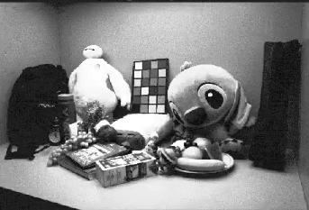
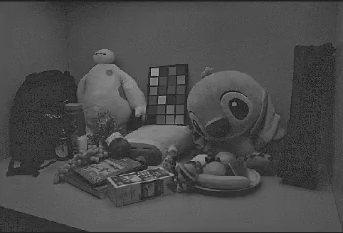

# 🌙 Low-Light Image Enhancement  
### Classical Image Processing vs Deep Learning Approach

This project explores multiple techniques for enhancing low-light images, comparing traditional image processing methods with a deep learning-based enhancement model.

The goal is to improve visibility, contrast, and illumination consistency in dark images while minimizing noise and artifacts.

---

## 📂 Project Structure

Low-Light-Enhancement/
│
├── dataset/
│ └── dark_images/
│
├── models/
│ └── lol_enhancer.pth.zip
│
├── results/
│        
├── src/
│ ├── img_project_dark.m
│ └── run_lol_enhancer.py
│
├── requirements.txt
├── README.md
└── LICENSE


---

# 🧠 Methods Implemented

## 🔹 1. Histogram Equalization
Enhances global contrast by redistributing intensity values across the full dynamic range.

- Improves brightness
- May amplify noise
- Global operation (no spatial awareness)

---

## 🔹 2. CLAHE (Contrast Limited Adaptive Histogram Equalization)
Applies histogram equalization locally with contrast limiting.

- Works on small tiles
- Prevents noise amplification
- Improves local contrast

---

## 🔹 3. Gamma Correction
Non-linear intensity transformation:

\[
I_{out} = I_{in}^{\gamma}
\]

- γ < 1 → Brightens image
- γ > 1 → Darkens image
- Simple but does not fix uneven illumination

---

## 🔹 4. Multi-Scale Retinex (MSR)
Based on human visual perception.

\[
R(x) = \log(I(x)) - \log(F(x) * I(x))
\]

- Separates illumination from reflectance
- Enhances details in shadows
- Can produce gray/flat appearance

---

## 🔹 5. Color Retinex Enhancement
Extends MSR to color images.

- Improves illumination consistency
- Enhances color visibility
- May introduce noise

---

## 🤖 6. Deep Learning Model (LOL Enhancer)

A trained neural network model for low-light enhancement.

### Advantages:
- Learns illumination correction
- Reduces noise automatically
- Preserves edges
- Produces natural colors
- Handles complex lighting conditions

---

# 📊 Comparison

| Method | Contrast | Noise | Illumination Consistency | Natural Colors |
|--------|----------|-------|--------------------------|----------------|
| Histogram Equalization | Medium | High | Low | Medium |
| Gamma Correction | Low | Low | Low | Medium |
| CLAHE | High | Medium | Medium | Medium |
| MSR | High | Medium | High | Gray-ish |
| Deep Learning | High | Low | High | Natural |

---

# 🖼 Results

## Original Dark Image


## Classical Enhancement (Color Retinex)


## Night Enhancement


## Deep Learning Enhancement


---

# 🚀 How to Run

## 1️⃣ Install Dependencies

```bash
pip install -r requirements.txt
```

## 2️⃣ Run Deep Learning Enhancer

```bash
python src/run_lol_enhancer.py
```

## 3️⃣ Run MATLAB Classical Pipeline

Open MATLAB and run:

```matlab
img_project_dark
```

---

# 📦 Requirements

- Python 3.8+
- PyTorch
- OpenCV
- NumPy
- Matplotlib
- MATLAB (for classical pipeline)

---

# 🎯 Key Takeaways

- Classical methods enhance contrast but often amplify noise.
- Retinex improves illumination but may reduce natural color appearance.
- Deep learning provides the most balanced and visually pleasing results.
- Learning-based models outperform traditional enhancement techniques in complex scenarios.

---

# 📚 Future Improvements

- Add quantitative metrics (PSNR, SSIM)
- Add real-time inference
- Deploy as web demo
- Train custom enhancement network
- Add video enhancement support

---

# 📜 License

MIT License

---

# 👤 Author

Abdullah
AI & Computer Vision Enthusiast  
```

---

# 🔥 Next Step (Important)

Now:

1. Add 2–3 comparison images inside `/results`
2. Replace "(Add your image here)" with:

```markdown

```


